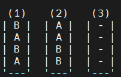
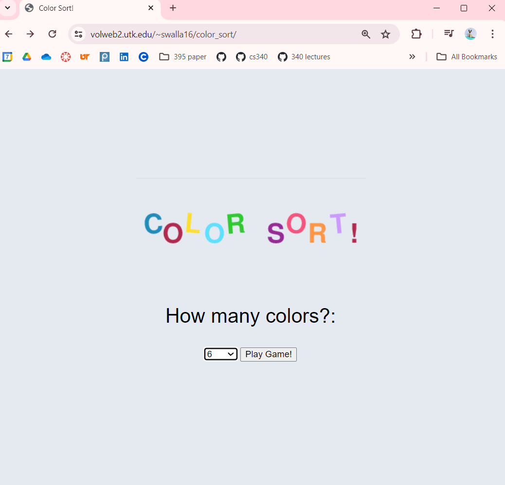
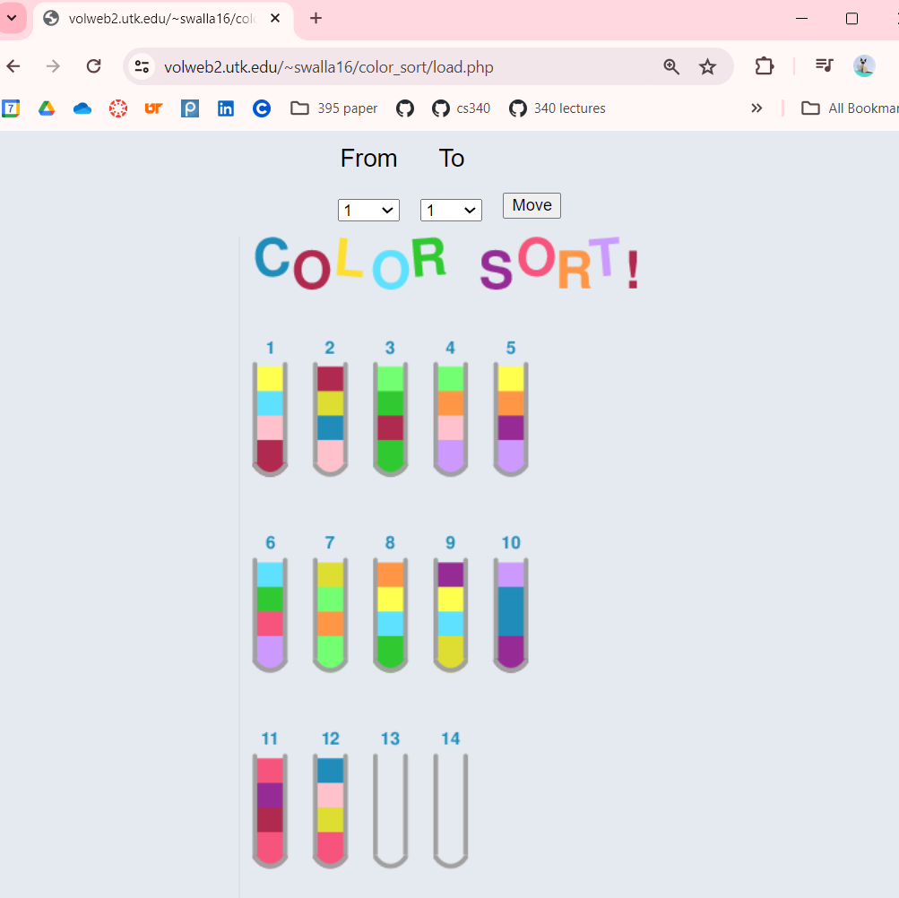
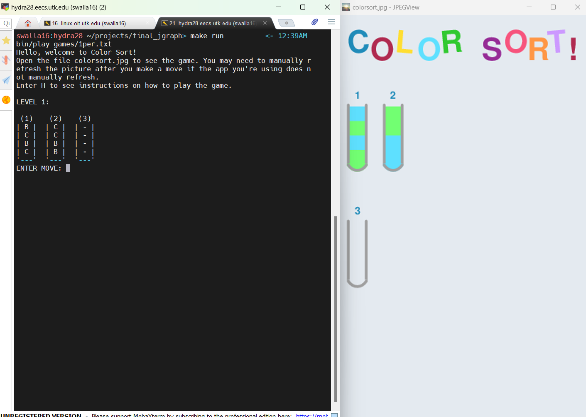
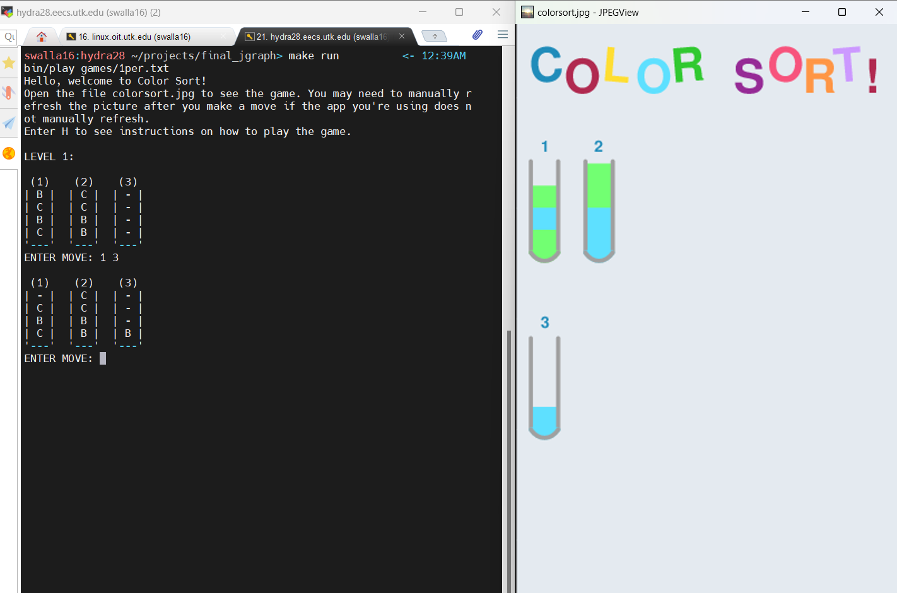

# Color Sort! Jgraph Edition
Shanna Wallace 
Jgraph Lab 
COSC 494 
Spring 2024

## Overview
This is a color sorting puzzle game that uses Jgraph to generate a jpg (colorsort.jpg) of the game state. It supports levels ranging from 2 colors to 12.  
Calling make run will lauch the game (bin/play), with 1 level per number of colors, starting with 2 colors.   
For purposes of demonstration, you can enter "N" or "n" to load the next level so you can see how the game display looks with varying number of colors.  
To actually play the game, enter your move on the terminal with the numbers of the bottles you'd like to move to and from separated by a space, and the game will generate a new jpg with the updated game state (you may need to manually refresh the jpg depending on the app you're using to view it). There are instructions of how to play color sort at the bottom.  
You may have to manually refresh the jpg after each move, depending on the program you're using to view it. 

# Project Details
## The Initial C++ Color Sort Implementation
I initially wrote a level generator that creates levels given a number of colors, as well as a game play program that takes user input from stdin and prints output to the console in simple ASCII art using letters instead of colors:  

## The Jgraph Implementation
Since a Color Sort game with no colors is very sad, for this project, I decided to use Jgraph to create a colorful display for my Color Sort game. 

### The Website Attempt
My plan was to host it on volweb at https://volweb2.utk.edu/~swalla16/color_sort/ so the player wouldn't have to manually refresh the jpg after every move, but I had difficulties getting the php exec calls to actually update the jpg. It updates if I run the commands from terminal, but not from the browser, so I'm guessing some issues with file permissions are going on that were above my (very low) web dev skill level to figure out in a short time frame. But, here is a description of what I attempted to do there anyway:  
You're greeted with a welcome page that calls a shell script (make_logo.sh) that generates the logo jpg. You choose the number of colors you'd like your level to have from the drop down menu and click the button, which runs a new_level.sh shell script to generate the level. 

  
new_level.sh inputs the requested number of colors into the level generator program, then pipes the level data into bin/create_jgraph, which creates a file (points.txt) of jgraph points for the game components. 
It then replaces the color values for the different colors of the blocks with rgb values from colors.txt. 
./jgraph is then called to create the graph. colorsort.jgr uses grep, awk, and sed to extract the points from points.txt and generate the jgraph input. Since the machine for volweb hosting doesn't have convert, I had to use Ghostscript to convert the output from postcript to jpg.  
Finally, it echos the url of the picture, which the webpage displays!  
 

 
Then you choose the bottles you'd like to move from and to from the drop down menus and it'll send your move to move.sh, which calls bin/make_move to execute the move. It then calls create_jgraph, jgraph, and gs as described above to create the jpg of the updated output, overwriting the jpg file. The page reloads to display the new output.

### The Console Version
Since I didn't get the permission issues figured out with my website, the game will have to played using the command line. 
You input the numbers of the bottles you'd like to move to and from separated by a space, and it will apply the move and update the jpg as described above.  
 
 

### The Gameplay Programs
bin/play1 <input-file> 
Plays 1 level of color sort given a txt file containing level data  
bin/play <input-file> 
Plays multiple levels of color sort given a txt file with 1 level's data per line. 

### The Level Data Files
games/1per.txt is the file containing a set of levels with 1 level for each number of colors from 2 to 12.  
level_files/1per is a directory containing files with individual levels.

## What is Color Sort?
Color Sort is a puzzle game that starts with blocks of various colors shuffled up in bottles. You are given 1 empty bottle if there are 2 or 3 colors to be sorted and 2 empty bottles if there are 4+ colors. 

The objective of the game is to sort all of the colors so that all blocks of the same color are in the same bottle.

## How to play Color Sort
You can move the top-most color from one bottle to another bottle if: 
* The source bottle is not empty
* The destination bottle is empty 
* The destination bottle is not empty, but has empty space available and the top color matches the top color in the source bottle.
* Neither bottle has already been sorted (full of blocks of only one color)  

Once all colors have been sorted so that all blocks of the same color are in the same bottle, the level is complete! 
