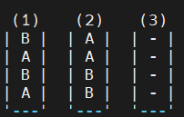
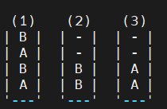
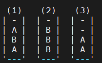
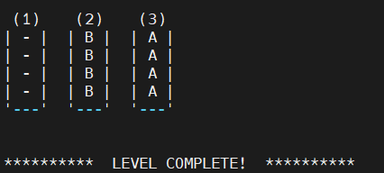

# Color Sort!
Written by Shanna Wallace 
Updated: 2/10/2024

This is a C++ implementation of a Color Sort game. 

**This version of the game only prints in 1 color, so it will use letters instead of colors.**

## What is Color Sort?
Color Sort is a puzzle game that starts with blocks of various colors shuffled up in bottles. You are given 1 empty bottle if there are 2 or 3 colors to be sorted and 2 empty bottles if there are 4+ colors. 

The objective of the game is to sort all of the colors so that all blocks of the same color are in the same bottle.

## How to play Color Sort
You can move the top-most color from one bottle to another bottle if: 
* The source bottle is not empty
* The destination bottle is empty 
* The destination bottle is not empty, but has empty space available and the top color matches the top color in the source bottle.
* Neither bottle has already been sorted (full of blocks of only one color)  

Once all colors have been sorted so that all blocks of the same color are in the same bottle, the level is complete! 

### Example Game:
Here's an example of a level with 2 colors (letters for this version). Your goal is to get all of the As in one bottle and all of the Bs in another: 

 To start, you can either move the top B from bottle 1 to bottle 3, or the top two As from bottle 2 to bottle 3. 
To move the top As from bottle 2 to bottle 3, we enter "2 3": 
ENTER MOVE: 2 3 
  

Now, the only available move is transferring the top B in bottle 1 to bottle 2: 
ENTER MOVE: 1 2 

 
You can move the top A in bottle 1 to bottle 3, then the B in bottle 1 to bottle 2, then the last A in bottle 1 to bottle 3 to complete the level: 
 

## How to Run the Game:
#### Create Executables
There is a makefile included that compiles the executables on Hydra, so just enter "make" in the cpp_ver directory to create your executables. They will be placed in the "bin" directory. 

#### Start the Game
To start the Color Sort game, enter the following command from your cpp_ver directory: 
bin/play input_file  
bin/play takes the name of an input_file containing data for a set of Color Sort levels as a command line argument.  
It will load the game data and display the game to stdout and take user input from stdin.  
After completing a level, it will load the next level in the file, until the user quits the game or all levels in the file have been completed. 

#### Where to Find Game Input Files:
Input files containing multiple levels per file are in the games directory. The command  
bin/play games/1per.txt will start a game with 1 level per number of colors, starting at 2 and going up to 12.  
The level_files directory contains directories with individual files for each level. 

## Game Input Files
#### Level Data String:
Color Sort will read level data from a one-line string in the following format:  
num_colors num_blocks num_bottles bottles[0] bottles[1] ... bottles[last]  
where num_colors is the number of colors in the level,
num_blocks is the number of blocks of color per bottle, and 
num_bottles is the number of bottles in the level.  
It reads the color value (letter) for each block in the bottles, starting with the top-most block in the 1st bottle and ending with the bottom-most block in the last bottle.  
For example, the level data string:   
2 4 3 B A B A A A B B - - - -   
will give the following output: 

#### Files Containing Multiple Levels:
You may put multiple levels in one file with one level's data per line. bin/play will load levels from  this file one line at a time, starting with the first line. 

## Creating Levels
#### Create 1 Level
bin/create1 will create 1 Color Sort level.  
It reads the number of colors for the level to contain from stdin, then outputs the level's data in the format bin/play will read to stdout.

#### Create a Set of Levels
bin/create_set will create a set of levels for Color Sort.

It takes the following command line arguments: 
bin/create_set <game_name> <output_type> <input_file> 

It generates the number and type of levels requested in <input_file>. You can output all of the levels' data to one file (one level per line), or create an individual file for each level, or both.  
game_name: The name you'd like to give this set of levels. 

output_type:  
 * f: Put all level data in one file, one level per line. It will be put in the games directory with name game_name.txt
 * d: Create a file for each individual level. It will put the files in the level_files directory, in a subdirectory named game_name. The level files will be named C_L.txt, where C is the number of colors in the level, and L is the number of the file with that number of colors.
 * b: Create both one file with all level data, plus individual files for each level. 
 
 input_file: Name of a file containing the instructions for the number of levels to create. 

#### Level Creation Instruction File
This is the input_file provided to bin/gen_levels.
This file should contain the number of colors for the levels, followed by a space, then the number of levels you'd like to create with that number of colors, followed by a space or newline.  
For example, if you want to create 5 levels with 2 colors and 10 levels with 3 colors,your input_file would need to be:  
 2 5  
 3 10
